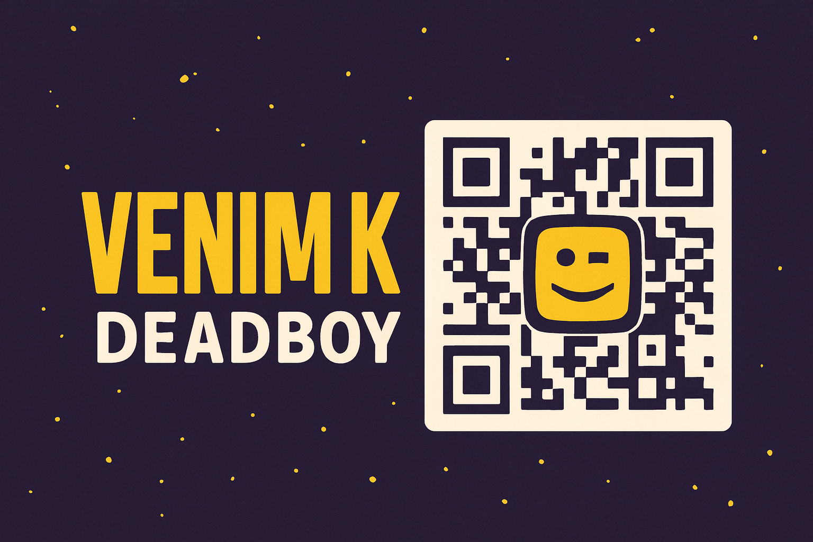

# 🔳 Deadboy QR Code Generator 🔲

    

A fast and user-friendly QR code generator web application that allows users to create customizable QR codes for various purposes.

## ✨ Features

### 📱 Multiple QR Code Types
- **URL**: Generate QR codes for websites and web pages
- **Text**: Create QR codes for plain text messages
- **Email**: Generate QR codes that open email clients with pre-filled addresses
- **Phone**: Create QR codes for phone numbers
- **SMS**: Generate QR codes that open SMS with pre-filled numbers
- **WiFi**: Create QR codes for WiFi network access
- **Location**: Generate QR codes for geographic coordinates
- **vCard**: Create QR codes for contact information

### 🎨 Customization Options
- **Error Correction Level**: Choose between L (Low), M (Medium), Q (Quartile), and H (High)
- **Size**: Adjust the size of your QR code
- **Color Customization**: Change foreground and background colors
- **Outline Toggle**: Add or remove the outline around the QR code
- **Logo Integration**: Add a custom logo to your QR code

### 🌈 Multiple Themes
- Dark Orange (Default)
- Light
- Neon
- Midnight
- Forest

### 💾 Export Options
- Download as PNG
- Download as SVG
- Download as JPEG

## 🚀 Usage

1. Select the type of QR code you want to generate
2. Fill in the required information
3. Customize your QR code appearance (optional)
4. Click the "Generate QR Code" button
5. Download your QR code in your preferred format

## 🛠️ Technologies Used

-  HTML5
-  CSS3
-  JavaScript
-  QRCode.js library
-  QRCode-SVG library
-  Phosphor Icons

## 🌐 Browser Compatibility

The application is compatible with all modern browsers including:
-  Chrome
-  Firefox
-  Safari
-  Edge

## 📄 License

© 2025 Deadboy All rights reserved.

## 🔗 Links

-  [GitHub Repository](https://github.com/venimk/QR-code-generator)

---

### 📊 QR Code Usage Statistics

| QR Code Type | Popularity |
|-------------|------------|
| URL | ⭐⭐⭐⭐⭐ |
| Text | ⭐⭐⭐⭐ |
| WiFi | ⭐⭐⭐⭐ |
| vCard | ⭐⭐⭐ |
| Email | ⭐⭐⭐ |
| Location | ⭐⭐ |

### 🎯 Key Benefits

- **Fast Generation**: Create QR codes in seconds
- **Highly Customizable**: Make your QR codes unique
- **No Registration Required**: Free to use without sign-up
- **Multiple Export Options**: Download in your preferred format

